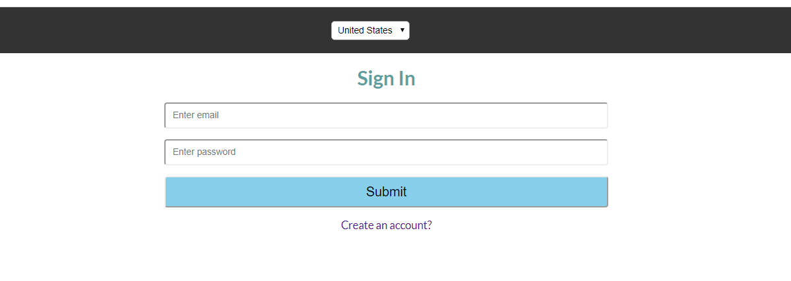
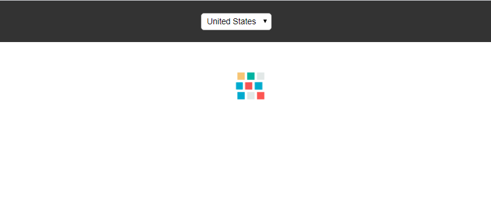
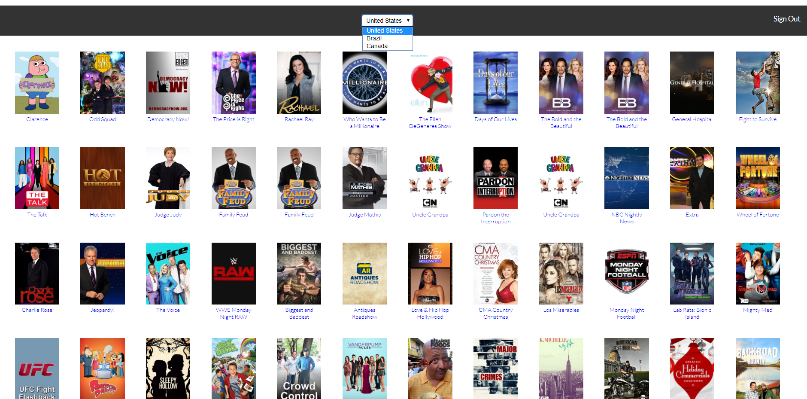

# TVMaze API Consumer

A modern TV show browsing application built with Next.js, consuming the [TVMaze API](https://www.tvmaze.com/api).

## Features

- Browse TV shows with search functionality
- View detailed show information
- Browse cast members
- Responsive design with modern UI
- Server-side rendering with Next.js
- Express.js backend integration

## Tech Stack

- **Framework:** [Next.js](https://nextjs.org/) 16.2.2
- **UI Library:** [React](https://react.dev/) 19.2.4
- **Backend:** [Express.js](https://expressjs.com/) 4.22.1
- **HTTP Client:** [Axios](https://axios-http.com/) 1.14.0
- **Styling:** CSS-in-JS with Styled JSX
- **Linting:** ESLint 8.x with TypeScript support
- **Formatting:** Prettier 3.x

## Getting Started

### Prerequisites

- Node.js 18.x or later
- npm or yarn

### Installation

```bash
# Clone the repository
git clone https://github.com/endang-ismaya/tvmaze-api-consume.git
cd tvmaze-api-consume

# Install dependencies
npm install

# Start development server
npm run dev
```

### Available Scripts

| Command                | Description                                              |
| ---------------------- | -------------------------------------------------------- |
| `npm run dev`          | Start Next.js development server (http://localhost:3000) |
| `npm run dev::express` | Start Express.js development server with nodemon         |
| `npm run build`        | Build the application for production                     |
| `npm start`            | Start production server                                  |

## API Reference

This project uses the [TVMaze API](https://www.tvmaze.com/api) for TV show data.

### Endpoints Used

- `GET /search/shows?q=:query` - Search for TV shows
- `GET /shows/:id` - Get show details
- `GET /shows/:id/cast` - Get show cast members

## Project Structure

```
.
├── components/       # React components
├── pages/           # Next.js pages
├── public/          # Static assets
├── server.js        # Express server setup
└── package.json     # Dependencies
```

## Security

This project has been updated to address security vulnerabilities:

- **Status:** ✅ All critical and high severity vulnerabilities resolved
- **Audit:** Reduced from 124 vulnerabilities (7 critical, 51 high) to 2 low severity

Last security update: April 2025

## Screenshots

### Login Page



### Loading State



### TV Show Details



### Cast Information


## Contributing

1. Fork the repository
2. Create your feature branch (`git checkout -b feature/amazing-feature`)
3. Commit your changes (`git commit -m 'Add amazing feature'`)
4. Push to the branch (`git push origin feature/amazing-feature`)
5. Open a Pull Request

## License

This project is open source and available under the [MIT License](LICENSE).

## Acknowledgments

- [TVMaze](https://www.tvmaze.com/) for providing the free TV show API
- [Next.js](https://nextjs.org/) team for the amazing framework

---

_This is a [Next.js](https://nextjs.org/) project bootstrapped with [`create-next-app`](https://github.com/vercel/next.js/tree/canary/packages/create-next-app)._
